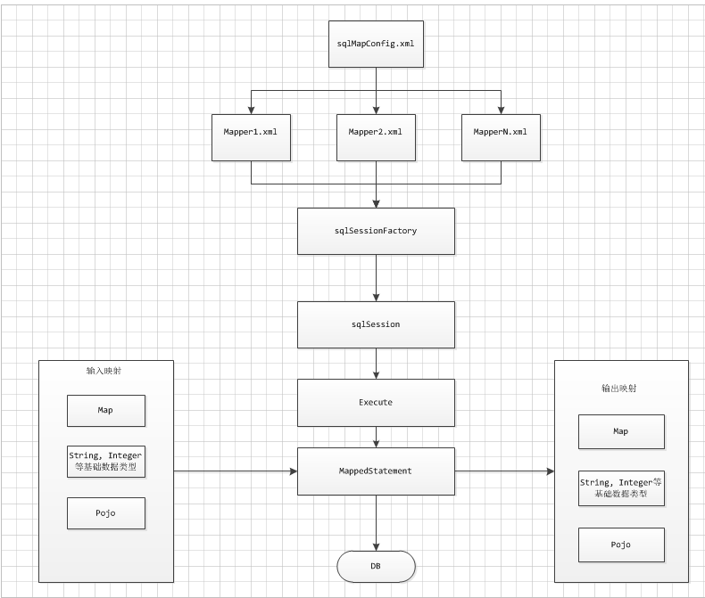
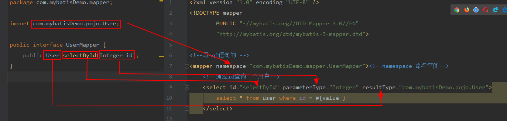
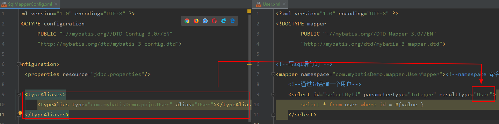
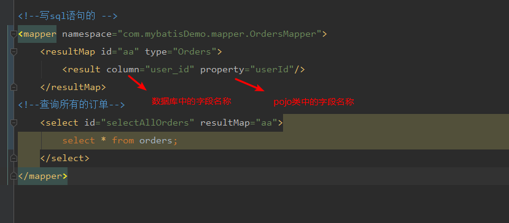
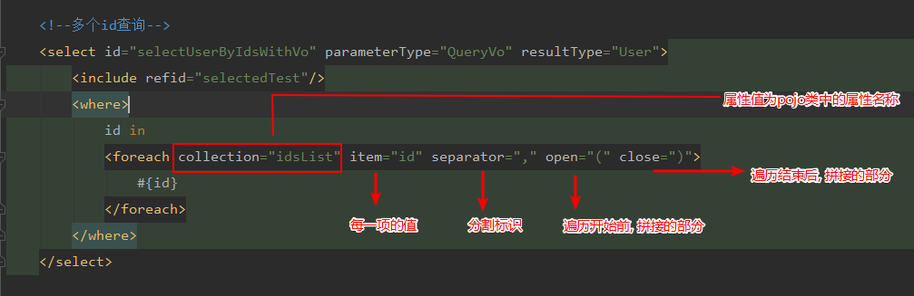

# Mybatis

*Mybatis架构图:* 



## 入门程序
1. 创建mybaits核心配置文件, sqlmapperconfig.xml文件   [eg: ](file:///G:\cache\idea\java\MybatisDemo\src\main\resources\SqlMapperConfig.xml)
2. 创建pojo对应的mapper.xml文件    [eg: ](file:///G:\cache\idea\java\MybatisDemo\src\main\resources\sqlMapper\User.xml)
3. 编写mapper.xml中的sql语句
4. 测试代码 [eg: ](file:///G:\cache\idea\java\MybatisDemo\src\test\java\com\mybatisDemo\Demo1Test.java)

## mybatis中的占位符写法:

* #{} 表示占位符 自带单引号, 里面的值可以随便写
* ${} 表示字符串拼接 不带单引号 里面的值只能写value

## mybatis和hibernate的不同

* mybatis不是一个完全的ORM框架, 需要自己手动编写sql语句, hibernate是一个完全的ORM框架, 自动生成sql语句.
* mybatis灵活, 可以严格的控制sql的执行. hibernate比较困难做到.
* mybatis不能做到数据库无关性, 如果切换数据库, 需要手动定义多套sql映射文件. 工作量大. hibernate切换数据库方便


## mapper动态代理开发

遵循四个原则: 

	1. 接口的方法名 == mapper.xml文件中的id名称
 	2. 返回值类型 == mapper.xml文件中的返回值类型
 	3. 方法的入参类型 == mapper.xml文件中的入参的类型
 	4. 命名空间和接口绑定




## SqlMapperConfig.xml配置内容

​	**以下的标签顺序不可以改变, 否则会报错**

1. properties(属性) 

   ​	读取配置文件

2.  typeAliases(别名)

     - typeAlias

   ​	如果配置了别名, 那么在mapper.xml中可以不写完整的类路径, 直接使用起的别名即可, 如果有很多的pojo类, 每一个都要编写一个

   

   

   * package

     如果使用package, 只需要指定父包即可, 会自动扫描下面的子包. 别名就是pojo类的类名

3.  mapper

   ​	除了resource 标签, 还有一个package标签常用. 

   ```xml
   <package name="com.mybatisDemo.mapper"/>
   使用这种方式, 要求mapper接口的名称和mapper.xml文件名称一致, 而且放在同一个包下.
   ```

   

   

## mybatis高级

### 输入输出映射

- 输入参数映射

  - 传递基本类型参数
  - 传递pojo类型参数

   [以上两个实例](src/main/resources/sqlMapper/User.xml)

  - 传递pojo包装对象

    包装对象: 一个pojo类中的一个属性是另外一个pojo

    [实例: ](src/test/java/com/mybatisDemo/mapper/UserMapperTest.java)

- 返回值映射

  - 输出简单类型

  - 输出pojo类型

    [以上连个实例参考](src/main/resources/sqlMapper/User.xml)

  - 输出resultMap

    resultType, resultMap区别: 

    ​	resultType, 自动映射, 如果pojo的属性名称和数据库字段的名称一致. 即可自动映射

    ​	resultMap, 手动映射,  如果pojo的属性名称和数据库字段的名称不一致, 需要手动映射

    

    [此配置文件的user_id为数据库中的字段, 与pojo类中的属性名称不一致](src/main/resources/sqlMapper/Order.xml)

### 动态sql

通过mybaits提供的各种标签方法实现动态拼接sql

- if标签

- where标签

```xml
<select id="selectBySexAndName" parameterType="User" resultType="User">
        select * from user
        <where>

            <if test="sex != null and sex != '' ">
                and sex = #{sex}
            </if>

            <if test="username != null and username != '' ">
                and username = #{username }
            </if>
        </where>

    </select>


if标签中的test条件成立, 则会将里面包裹的sql拼接, 否则忽略
where标签作用: 当条件成立的时候, 会去除第一个前面的and
```


- sql片段

  提取公共的sql片段, 在之后的sql中可以引用

```xml
	<!--提取公共的sql片段-->
    <sql id="selectedTest">
        select * from user
    </sql>
    
     <!--根据性别和姓名查询用户-->
    <select id="selectBySexAndName" parameterType="User" resultType="User">
        <include refid="selectedTest"/>
        <where>

            <if test="sex != null and sex != '' ">
                sex = #{sex}
            </if>

            <if test="username != null and username != '' ">
                and username = #{username }
            </if>
        </where>

    </select>
```


- foreach标签

  

  如果是单个的array 或者 list作为参数, foreach 中的collection属性的值 对应为

  array 和 list, 如果是包装类中的属性, 使用属性名称.

  [打开后搜索 "多个id查询"](src/main/resources/sqlMapper/User.xml)

### 关联查询

- 一对一关联

  需要手动映射 , 使用resulMap, 不会自动映射相同的字段, 都需要手动映射

  [打开后查找 一对一关联](src/main/resources/sqlMapper/Order.xml)

  

- 一对多关联

  需要手动映射 , 使用resulMap, 不会自动映射相同的字段, 都需要手动映射, 

  **注意:**  一对多的映射文件配置中, collection标签的属性类型使用ofType

  [查找 一对多](src/main/resources/sqlMapper/User.xml)

### mybatis整合spring

- 如何整合spring

  整合思想: 

  - sqlSessionFactory对象放到spring容器中作为单例的存在
  - 传统Dao开发中, 从spring容器中获得sqlsession对象
  - Mapper代理形式中, 从spring中直接获取mapper代理对象
  - 数据库连接以及数据库连接池, 事务管理 交给spring

### mybatis(逆向工程)

